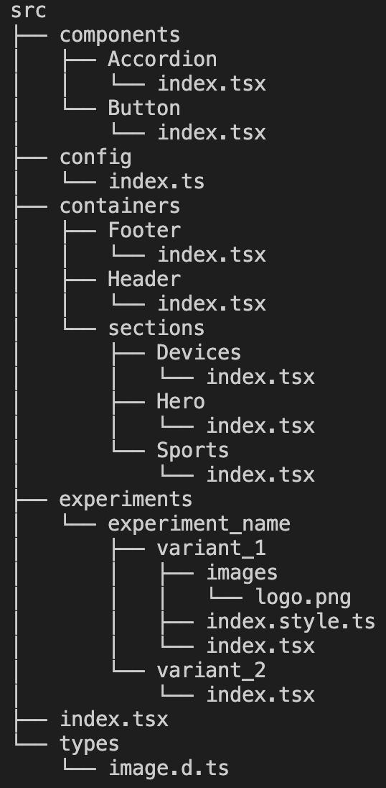

# Project file structure

## Overview

-------------

### Components
The `components` folder should contain all sorts of basic components used in the page, such as Heading, Icons, Button, Accordion, Modal, and whatever else we may add in the future. By separating these components into this folder, we can make it very easy in the near future to split this folder into a separate project, or what we commonly refer as A&R Pattern Library.

### Config
The `config` folder should contain any kind of configuration required by React or any other library, to make the application render on the screen. So we can use it for example to define routes, setup a date or i18n library, anyway, something between those lines.

### Containers & Sections
The `containers` folder may have Container Components, which as quoted below:

> ... are almost always the parents of Presentational Components (in our case, the components within the `components` folder). In a way, they serve as a intermediary between Presentational Components and the rest of the application.

Within our containers, we have a special kind which are the section components. They are directly used by the experiments, and they represent a section of the page to be displayed. Examples:

- Hero
- Sports
- Devices

### Experiments
Experiments may import specific versions of the sections, implement some specific tracking required for them, and whatever else may be necessary for them to be executed.

## How may this evolve in the future?
- By separating the components from this project, we may lose the components folder
- Hooks? How do they fit into this project?